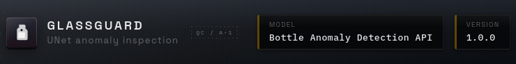

<!-- Canonical repository: https://github.com/sidnei-almeida/anomaly_detection_unet -->
<p align="center">
  
</p>

<h1 align="center">anomaly_detection_unet</h1>

<p align="center">
  <strong>Production-oriented FastAPI REST service for bottle anomaly detection: a reconstructive U-Net trained on the MVTec AD &ldquo;bottle&rdquo; subset. No interactive CLI is part of this repository.</strong>
</p>

<p align="center">
  <a href="LICENSE"></a>
  <a href="https://www.python.org/downloads/"></a>
  <a href="https://fastapi.tiangolo.com/"></a>
  
</p>

<p align="center">
  <a href="#overview">Overview</a> ·
  <a href="#gallery">Gallery</a> ·
  <a href="#features">Features</a> ·
  <a href="#requirements">Requirements</a> ·
  <a href="#git-lfs-large-files">Git LFS</a> ·
  <a href="#installation--quick-start">Quick start</a> ·
  <a href="#api-reference">API</a> ·
  <a href="#docker">Docker</a> ·
  <a href="#deploying-to-hugging-face-spaces">Hugging Face</a> ·
  <a href="#configuration">Configuration</a> ·
  <a href="#project-layout">Project layout</a> ·
  <a href="#troubleshooting">Troubleshooting</a> ·
  <a href="#author">Author</a> ·
  <a href="#license">License</a>
</p>

---

## Overview

**anomaly_detection_unet** exposes a compact **REST API**, not a command-line wizard. Inference lives entirely in **`app.py` + [`model_utils.py`](model_utils.py)**: FastAPI validates uploads while the U-Net runs in **eval** mode over CPU tensors. Detection is **reconstruction-based**: the network fits normal textures; deviations spike **mean squared error** between crop and reconstruction. Once the scalar error clears `classification_threshold` (see [`models/bottle_unet_config.json`](models/bottle_unet_config.json)), the classifier returns **Anomaly Detected** instead of **Normal**. Responses may optionally pack pixel artefacts (**map**, **binary mask**, **heatmap overlay**, **bounding box**) as PNG fragments encoded in **base64 JSON**.

| Capability | Outcome |
|------------|---------|
| **`POST /infer`** | Multipart image ➝ label + diagnostics + latency. |
| **Pixel artefacts** | OpenCV post-processing on anomaly maps feeding masks and ROI rectangles. |
| **Stable serving footprint** | Weights/load config once on FastAPI `startup`; callers poll `/health` while loading completes. |
| **Container-friendly Dockerfile** | Port **7860** matches Hugging Face Spaces conventions. |

`run_app.sh` + [`requirements-gpu.txt`](requirements-gpu.txt) are **legacy exploratory** assets (historical Streamlit-oriented stack) and diverge from the shipping API path outlined below — treat **`uvicorn app:app`** as source of truth.

---

## Gallery

### Example bottle crops (inputs you can POST to `/infer`)

The **`imagem/`** directory keeps representative RGB crops bundled with this repo (`000.png` for a sane baseline; `anomaly_*.png` for damaged samples — naming follows the project's demo set). Serve them manually with Swagger, `curl`, or any HTTP client; they are omitted from Docker builds (see `.dockerignore`).

| Normal (baseline) | Anomaly sample |
|:---:|:---:|
|  |  |
| *Figure 1a. Typical good bottle appearance used as a smoke-test input (`imagem/000.png`).* | *Figure 1b. Defect-rich crop illustrating how reconstruction error spikes (`imagem/anomaly_1.png`).* |

### Exploring the REST surface

Swagger UI renders auto-generated schemas for multipart uploads (`/infer`) plus documentation shortcuts coming from `/`.

<p align="center">
  
</p>

<p align="center">
  <em><strong>Figure 2.</strong> Interactive OpenAPI tooling around the FastAPI app (example screenshot — local UI may vary slightly).</em>
</p>

---

## Features

| Area | Description |
|------|-------------|
| **REST ergonomics** | Multipart uploads with browser-friendly docs at `/docs` and `/redoc`. |
| **Optional artefacts** | Flip `include_visualizations=false` to skip heavy payloads. |
| **Sanity-checked weights** | Startup refuses microscopic `.pth` blobs (often Git LFS pointer mistakes). |
| **Relaxed default CORS** | Good for playgrounds — scope-down before production exposures. |

Jupyter artefacts (`notebooks/`, `training_history/`) remain for reproducibility audits. Demo snapshots under `images/` + `imagem/` are documentation aids and **stay out** of the minimal runtime image enforced by `.dockerignore`.

---

## Requirements

| Component | Notes |
|-----------|-------|
| **Python** | 3.10+ (matches [`Dockerfile`](Dockerfile)). |
| **Torch CPU** | Prebuilt wheels via [`requirements.txt`](requirements.txt). |
| **Weights** | `models/bottle_unet_best.pth` — served through **Git LFS** (never commit raw multi‑hundred MB blobs to plain Git). |
| **Imaging deps** | `opencv-python-headless`, `pillow`, `numpy` from requirements. |
| **Git LFS** | Host-side client required so historical checkpoints hydrate after clone (see section below). |

> **Operational notes:** **`docker build` only sees paths not excluded by [`.dockerignore`](.dockerignore)** — demos under `images/` / `imagem/` never bake into default images. Hydrate **`models/bottle_unet_best.pth`** to real binaries on the host (**`git lfs pull`**) *before* `docker build`; otherwise the layer will copy Git LFS text pointers (~130 bytes) and the runtime health check fails.

---

## Git LFS (large files)

This repository declares `*.pth`, `*.pt`, `*.ckpt`, and `*.safetensors` in [`.gitattributes`](.gitattributes). Without the Git LFS filter you will only checkout the **text pointers** (~130 bytes); `setup_model_and_config()` will then raise on “unexpectedly small” weights.

Minimal workflow after cloning:

```bash
# Install the Git LFS client from your distro or https://git-lfs.github.com/, then:
git lfs install        # once per user account / machine shell
git lfs pull           # inside the cloned repo whenever pointers need hydrating
git lfs ls-files       # should list models/bottle_unet_best.pth
```

Step-by-step (in Portuguese, distros HF/CI hints): **[`GIT_LFS.md`](GIT_LFS.md)**.

---

## Installation & quick start

```bash
python -m venv .venv
source .venv/bin/activate
pip install --upgrade pip
pip install -r requirements.txt

uvicorn app:app --host 0.0.0.0 --port 8000
```

Navigate to [http://localhost:8000/docs](http://localhost:8000/docs) — use the **`imagem/`** crops from **Figure 1** as ready-made payloads when iterating locally.

Minimal `curl` probe (classification only — omit heavy artifacts):

```bash
curl -s -X POST "http://localhost:8000/infer?include_visualizations=false" \
  -F "file=@imagem/anomaly_1.png" | jq
```

*(Adjust host/port/path if you deploy differently.)*

---

## API reference

### Core routes

| Endpoint | Method | Description |
|----------|--------|-------------|
| `/health` | GET | Readiness (`status`: `ready` / `loading`). |
| `/` | GET | Service metadata plus documentation anchors. |
| `/infer` | POST | Executes reconstruction anomaly logic on an RGB upload. |

### `POST /infer`

- **`file`** *(required)*: multipart image (`png`/`jpg`/`jpeg`).
- **`include_visualizations`** *(query flag, defaults `true`)* toggles anomaly map artefacts.

Representative payload (thresholds mirrored from current JSON config):

```json
{
  "prediction": "Anomaly Detected",
  "reconstruction_error": 0.00123,
  "thresholds": {
    "classification": 0.000205,
    "pixel_visualization": 6,
    "bounding_box": 15
  },
  "latency_ms": 87.421,
  "image_size": { "width": 1024, "height": 1024 },
  "artifacts": {
    "anomaly_map": { "format": "PNG", "encoding": "base64", "data": "..." },
    "binary_mask": { "format": "PNG", "encoding": "base64", "data": "..." },
    "heatmap_overlay": { "format": "PNG", "encoding": "base64", "data": "..." },
    "bounding_box": { "format": "PNG", "encoding": "base64", "data": "..." }
  }
}
```

Omits `"artifacts"` when `include_visualizations=false`.

---

## Docker

```bash
docker build -t bottle-anomaly-api .
docker run --rm -p 7860:7860 bottle-anomaly-api
```

Containers bind **7860** for Hugging Face parity (`PORT=7860`). Mount datasets manually if needed — default image ships without `imagem/`.

---

## Deploying to Hugging Face Spaces

1. **`git lfs install` + track `*.pth`** ahead of collaborating on weights.
2. Push blobs + codebase with LFS manifests intact.
3. Configure the Space as **Docker**.
4. Keep massive checkpoints off plain Git blobs (platform blob ceiling).

---

## Configuration

[`models/bottle_unet_config.json`](models/bottle_unet_config.json) parameters:

| Key | Responsibility |
|-----|----------------|
| `classification_threshold` | MSE cutoff for **Normal / Anomaly**. |
| `pixel_visualization_threshold` | Unsigned int mask threshold on anomaly heatmaps. |
| `bounding_box_threshold` | Sensitive mask cutoff prior to contours. |
| `dilation_iterations` | Morphology passes before extracting bounding rectangles. |

---

## Project layout

```
.
├── app.py                     # FastAPI app + routes (/health, /, /infer)
├── model_utils.py             # U-Net definition + preprocessing + artefacts
├── models/
│   ├── bottle_unet_best.pth   # Trained checkpoint (Git LFS)
│   └── bottle_unet_config.json
├── imagem/
│   ├── 000.png                # Demo baseline (normal-looking crop)
│   └── anomaly_*.png          # Demo defects for smoke tests / README figures
├── images/
│   ├── header.png             # README hero artwork
│   └── softrware.png          # Swagger / UI screenshot supplemental visual
├── notebooks/                # Offline training/analysis material
├── training_history/
├── GIT_LFS.md                # Clone / distro / HF notes (Git LFS)
├── Dockerfile
├── requirements.txt          # Torch CPU stack + FastAPI runtime
├── requirements-gpu.txt      # Legacy exploratory Streamlit-esque stack (non-container default)
├── run_app.sh               # Historical launcher (references Streamlit; use uvicorn instead)
└── README.md
```

---

## Troubleshooting

| Symptom | Likely mitigation |
|---------|-------------------|
| `FileNotFoundError` / microscopic checkpoint | Run `git lfs install` **before** clones when possible; inside repo run `git lfs pull`. See **[`GIT_LFS.md`](GIT_LFS.md)** & [`.gitattributes`](.gitattributes). |
| HTTP 503 on `/infer` | Model still hydrating — hammer `/health` until `"status": "ready"`. |
| Weird masks / hallucinated ROI | Revisit thresholds or dilation knobs in JSON. |
| Offline demo images missing inside container | Expected — bake them in deliberately or POST from CI runner via volume mounts if ever required. |

---

## Author

| | |
| --- | --- |
| **Maintainer** | [Sidnei Almeida](https://github.com/sidnei-almeida) ([@sidnei-almeida](https://github.com/sidnei-almeida)) |
| **Repository** | [github.com/sidnei-almeida/anomaly_detection_unet](https://github.com/sidnei-almeida/anomaly_detection_unet) |
| **LinkedIn** | [linkedin.com/in/saaelmeida93](https://www.linkedin.com/in/saaelmeida93/) |

---

## Contributing

Issues & pull requests are welcome — cite **Torch + FastAPI** versions plus whether Git LFS produced real weight bytes when reporting loading failures.

---

## License

Distributed under the [MIT License](LICENSE).

---

<p align="center">
  <sub>MVTec AD is curated by MVTec Software GmbH. This repository documents an academic-style reproduction harness and isn&rsquo;t affiliated with MVTec Software GmbH.</sub>
</p>
